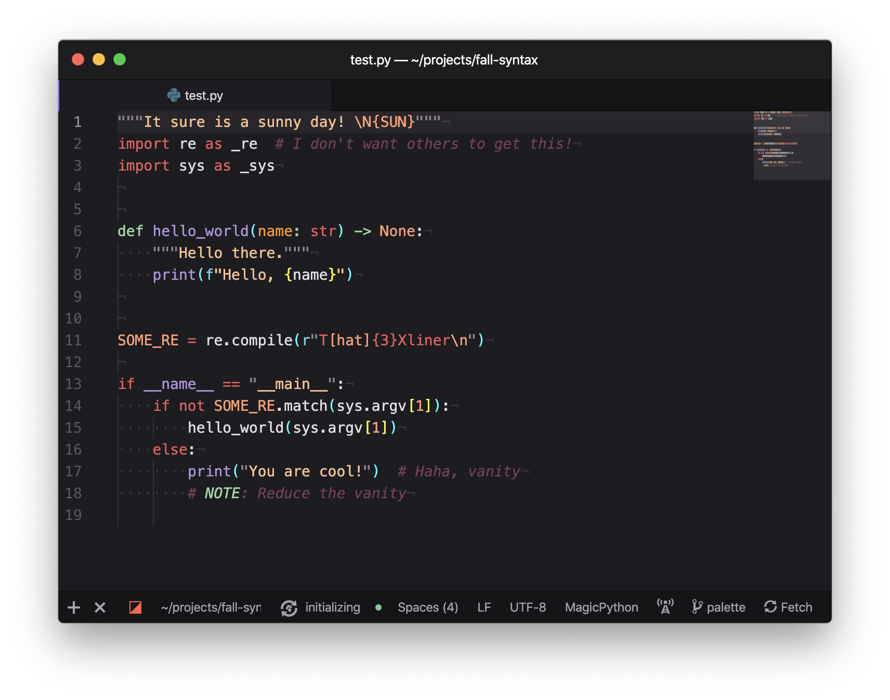
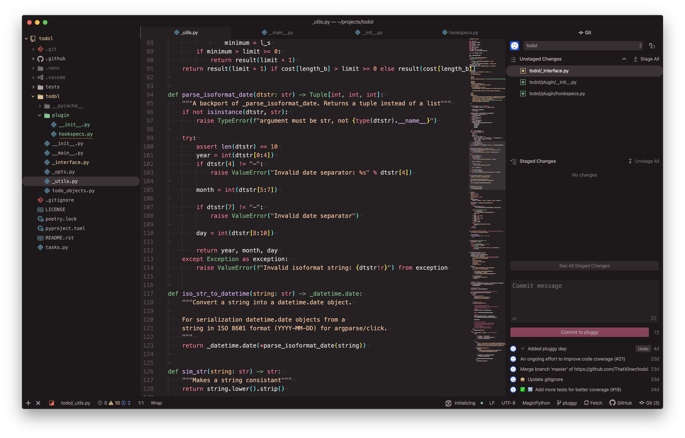

# fall-syntax
 [](https://atom.io/themes/fall-syntax) [](https://atom.io/themes/fall-syntax) [](https://atom.io/)


*Fall Syntax* is a syntax theme with 3 design points in mind:

 - Reduce [blue light](https://www.verywellhealth.com/blue-light-exposure-3421985)\*
 - Make code clear
 - Still look good

<sub>*does not prevent 100% blue light from monitor. DO NOT USE AS A REPLACEMENT FOR BLUE LIGHT BLOCKING GLASSES. Coding breaks are still recommended.</sub>

---



---


I've sought out to build a syntax theme on top of those principals; something that minimizes the blue but still looks good. Why? I knew that [blue light causes eyestrain and headaches](https://www.foreyes.com/blog/10-ways-how-blue-light-can-affect-you), which are a nuisance for the programmer (and the average computer user).

After about a month of color-picking, discussion, and color-tweaking, *Fall Syntax* was here. Every hue, every shade, was **meticulously hand-picked**, tested, and **checked against standards** such as the [WCAG 2.0 contrast ratio criterion](https://www.w3.org/TR/UNDERSTANDING-WCAG20/visual-audio-contrast-contrast.html).

Naturally, the colors are reddish and aesthetic, giving that **post-summer vibe**.

Besides warm colors, *Fall Syntax* features some nice **perks** such as

 - Trivial components of code (like comments and bracket pairs) are **faded**
 - Specialized **RegEx syntax support**
 - **Increased contrast** on function/class definitions\*

Enjoy!

<sub>*support may vary depending on language. Check the FAQ for more info.</sub>

---

This is my first syntax theme 🎉, originally forked from [Atomic-monokai-pro-syntax][1]. Except now, this looks *nothing* like [atomic-monokai-pro-syntax][1].

I hope you like it! ❤️. If you do, **please star this repo and star this theme on Atom**. That way, you can let other people find this theme.

Hey, if you don't like this syntax theme ("it's too reddish!") I *highly recommend* @tterb's [Atomic-monokai-pro-syntax](https://atom.io/themes/) or @jackw01's [summer-night-syntax])(https://atom.io/themes/summer-night-syntax)

> According to GitHub Analytics only a small percentage of you have actually starred, so please star the repository.
 - [@KomodoKode](https://github.com/KomodoKode)
## Installation

This theme can be installed from within Atom or via the command:
```sh
$ apm install fall-syntax
```
After installation, you can activated by going to the **Settings > Themes** section and selecting it from the **Syntax Themes** drop-down menu.

## FAQ

Q: **I need this for other editors**

A: I'm glad you like this but I really don't know how to port this to other editors other than Atom. While I can use [this awesome tool][tool], the generated syntax highlighting may be degraded and doesn't meet the quality standards I boast for. That is, unless it does. Then open an issue about telling me about the ports!

Q: **This syntax highlighting is degraded**

A: You're probably having tree-sisters parsing on. While it is a promising technology, it currently seems to degrade syntax highlighting. I recommend you turn it off on Settings > Core. If that's not the case **feel free to complain in the issues or send a pull request!**. I have rewritten the \_base.less by hand so I have probably dropped support for some markup/programming languages.

Q: **This looks like (insert some theme name)**

A: Welp. Great minds think alike!

Q: **How can I contribute?**

A: Either ~~complain about the colors~~ professionally critique the theme in the issues or send a pull request for some different colors/arrangements. Or you can **help me port this theme to other editors** I'll merge it if I like it!

<!-- ## More images

<details>

<summary>Click to expand</summary>

</img>
</img>
</details> -->

## Credits

Credits to

 - My ***epic*** friends [@KomodoKode](https://github.com/KomodoKode) and [@thatdevboyjun](https://github.com/thatdevboyjun) for feedback, suggestions, and critique! Thanks guys!
 - @tterb for his *amazing* https://github.com/tterb/Atomic-Monokai-Pro-syntax
 - The [City lights theme][2] for major inspiration
 - Wimer Hazenberg and his [Monokai Pro theme](https://monokai.pro/), which has heavily influenced the design. You can see traces of Monokai hidden in the theme
 - [Coolors.co](https://coolors.co/) for the *epic* palette generator (and color editor)

[1]: https://github.com/tterb/Atomic-Monokai-Pro-syntax
[2]: http://citylights.xyz/
[tool]: https://mswift42.github.io/themecreator/
